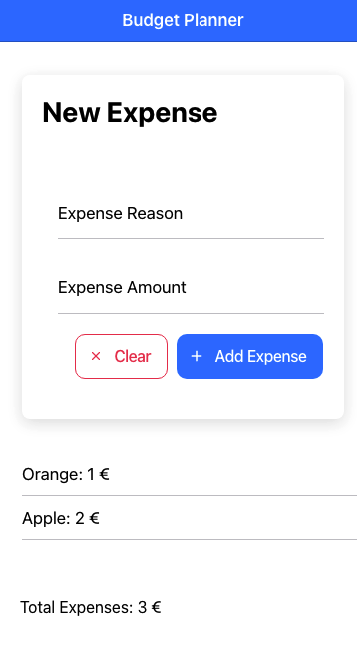

# ionicCourseVanillaJs

Just dummy app, 1 to 1 rewritten from the [Ionic course](https://www.udemy.com/course/ionic-2-the-practical-guide-to-building-ios-android-apps/?utm_source=adwords&utm_medium=udemyads&utm_campaign=LongTail-New_la.EN_cc.ROWMTA-B&utm_content=deal4584&utm_term=_._ag_98771201205_._ad_533999956744_._kw__._de_c_._dm__._pl__._ti_dsa-1007766171312_._li_9062586_._pd__._&matchtype=&gclid=Cj0KCQjw7KqZBhCBARIsAI-fTKLLkV6GTRR0oOdcs0dyqZ6cIsCHHW8Cm_3PlBxyiRRY0J3CD9S2H-EaAsu9EALw_wcB). Example of Ionic framework with the use of Vanilla Javascript.

 

    
 

